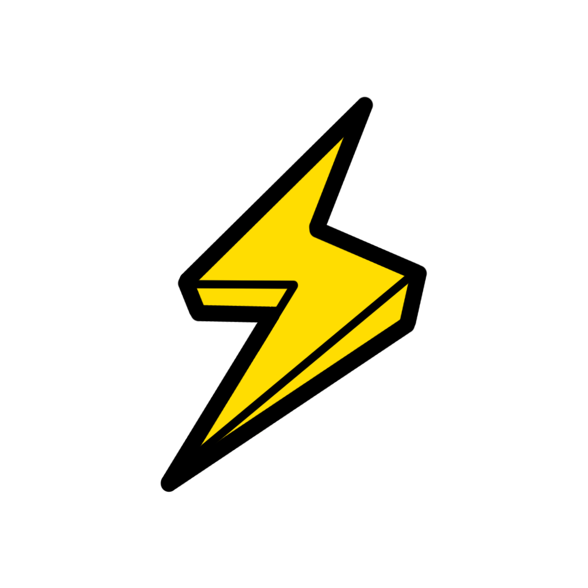
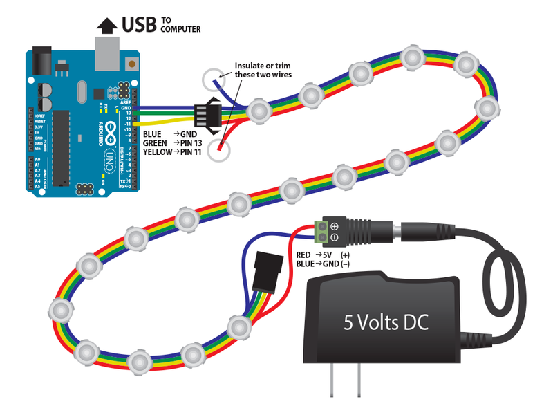
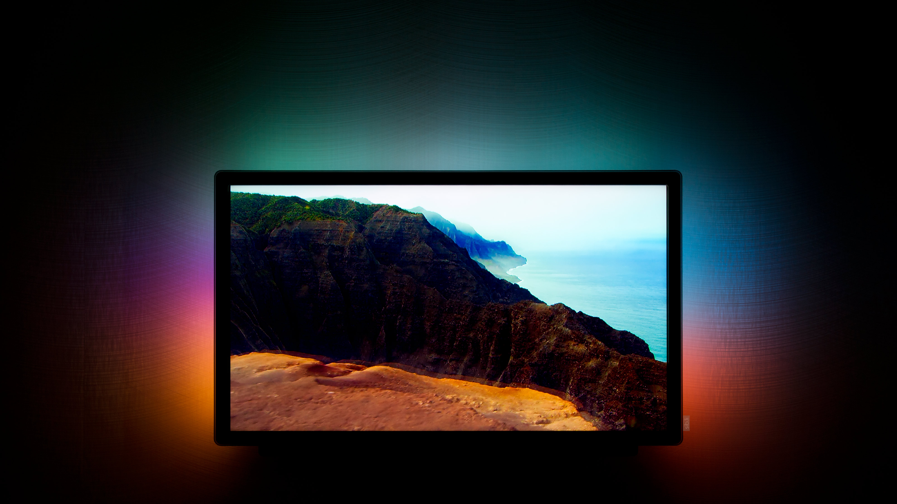

# 
Lightning-quick backlighting system.

## Development
Just clone or fork repository into your workspace. Then you should be able to import macOS project into Xcode, Arduino module can be edited using [Arduino IDE](https://www.arduino.cc/en/main/software).

## Wiring

    

## Interface

    
    
    

## Results

    

