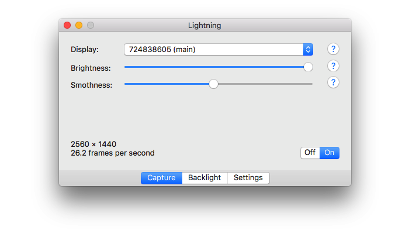
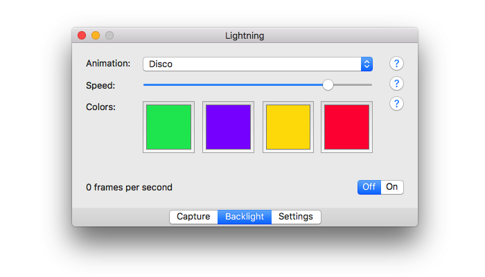
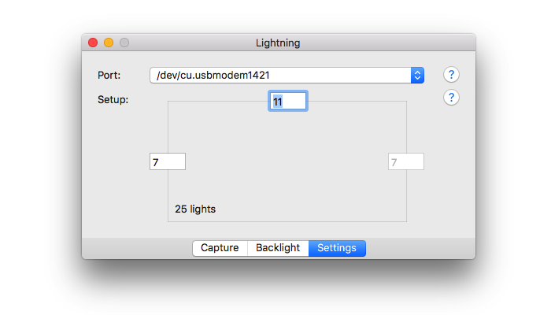

# 
Ambilight-like backlighting system.

    

## Requirements

- Mac,
- WS2801-based digital RGB LED strand,
- 5V power supply,
- Arduino Uno, but it may work with other Arduino models as well.

## Wiring scheme

    

## Software setup

1. Clone this repository.
2. Use [Arduino IDE](https://www.arduino.cc/en/main/software) to deploy `arduino/lighning/lightning.ino` to Arduino.
3. Build macOS application from Xcode or [download latest release](https://github.com/maciaszczykm/lightning/releases).

## Interface

    
    
    

